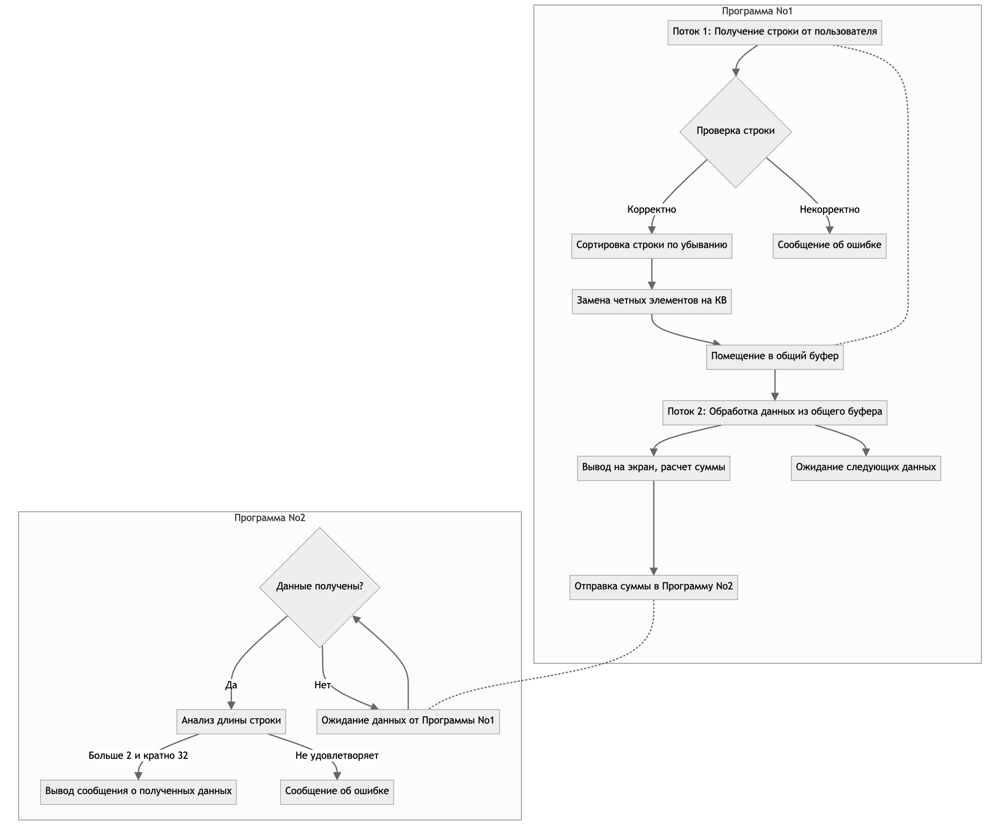

# Проект: Взаимодействие программ через сокеты

## Описание

Этот проект состоит из двух программ, которые взаимодействуют друг с другом через сокеты. Каждая программа имеет свои задачи и требования к работе. Ниже приведено описание каждой программы и их взаимодействия.


## Программа No1

### Описание

Программа No1 предназначена для обработки ввода пользователя и выполнения этой задачи с помощью двух потоков, использующих общий буфер.

- **Поток 1**:
  - Принимает строку ввода от пользователя.
  - Проверяет, что строка состоит только из цифр и не превышает 64 символов.
  - Сортирует строку по убыванию.
  - Заменяет все четные цифры на латинские буквы "КВ".
  - Помещает обработанную строку в общий буфер.
  - Ожидает дальнейшего ввода пользователя.

- **Поток 2**:
  - Обрабатывает данные, помещенные в общий буфер.
  - Очищает буфер после обработки.
  - Выводит обработанные данные на экран.
  - Рассчитывает сумму всех числовых значений в данных.
  - Отправляет полученную сумму в Программу No2.
  - Ожидает следующие данные.

**Примечание по синхронизации**: Взаимодействие между потоками должно быть синхронизировано без использования глобальных переменных.

**Примечание по независимости**: Программа No1 должна работать независимо от статуса программы No2. Внезапное прекращение работы программы No2 не должно немедленно влиять на ввод пользователя. При перезапуске программы No2 необходимо произвести повторное подключение.

## Программа No2

### Описание

Программа No2 предназначена для получения и обработки данных, отправленных Программой No1.

- **Обработка данных**:
  - Ожидает получение данных от Программы No1.
  - Анализирует длину полученных данных.
  - Если длина данных больше 2 символов и кратна 32, выводит сообщение о получении данных.
  - В противном случае выводит сообщение об ошибке.
  - Продолжает ожидать данные.

**Примечание по независимости**: Программа No2 должна функционировать независимо от статуса программы No1. Внезапное прекращение работы программы No1 не должно немедленно влиять на отображение данных. Программа No2 должна ожидать подключения программы No1 в случае потери связи.

## Настройка и запуск

### Требования

- Среда Linux с установленным `g++`.
- Основы программирования с использованием сокетов и многопоточности в C++.

### Компиляция

Для компиляции программы перейдите в соответствующий каталог программы и выполните:

```sh
make build #make build_debug - для отображения логов во время исполнения программы
make run
